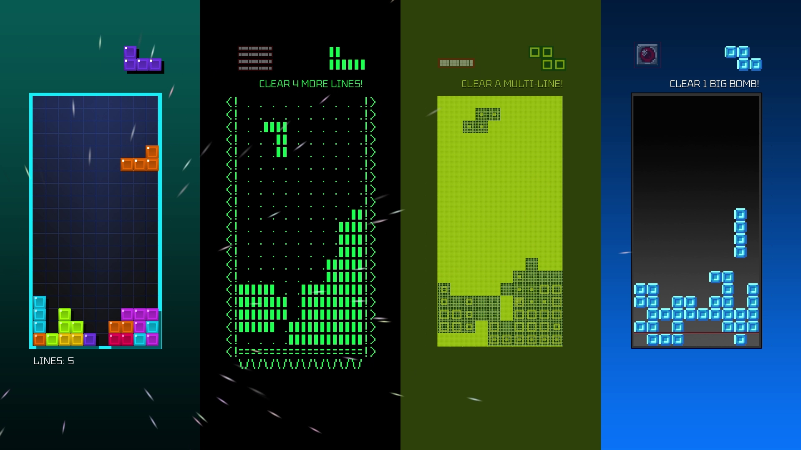
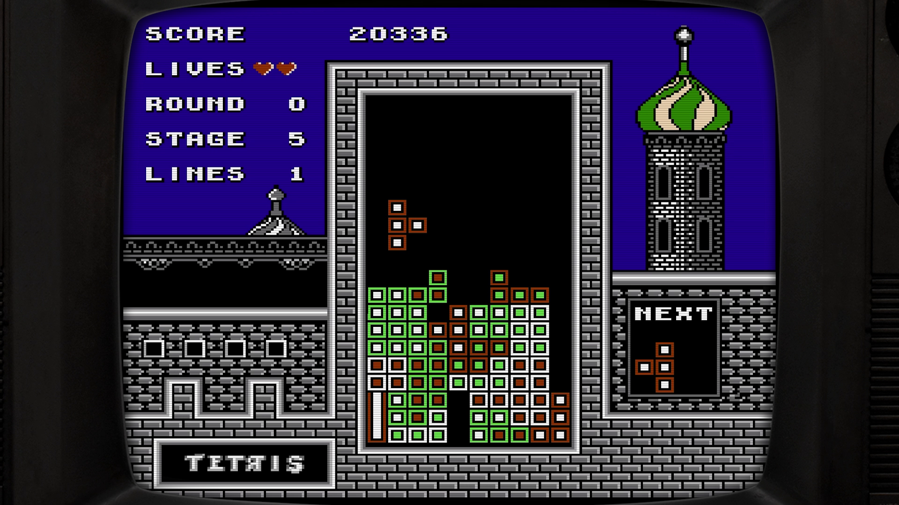

Digital Eclipse und The Tetris Company haben bekanntgegeben, welche Titel im bald erscheinenden Tetris Forever enthalten sein werden.

Tetris Forever ist eine Kollektion, die die Geschichte hinter dem beliebtesten Puzzle Game der Welt in einem virtuellem, interaktiven Museum präsentiert. Sie enthält neben 15 verschiedenen Tetris-Spielen noch Archivmaterial sowie über 90 Minuten an neuen Videos mit Interviews und Dokumentationsmaterial.

## Enthaltene Spiele

- Tetris, von Spectrum Holobyte, 1988, Apple II
- Tetris, von Bullet-Proof Software, 1988, Famicom
- Hatris, von Bullet-Proof Software, 1990, Famicom
- Tetris 2 + Bombliss, von Bullet-Proof Software, 1990, Famicom
- Hatris, von Bullet-Proof Software, 1991, Game Boy
- Hatris, von Bullet-Proof Software, 1992, Nintendo Entertainment System
- Super Tetris 2 + Bombliss, von Bullet-Proof Software, 1992, Super Famicom
- Tetris Battle Gaiden, von Bullet-Proof Software, 1993, Super Famicom
- Super Tetris 2 + Bombliss Genteiban, von Bullet-Proof Software, 1993, Super Famicom
- Super Tetris 3, von Bullet-Proof Software, 1994, Super Famicom
- Super Bombliss, von Bullet-Proof Software, 1995, Super Famicom
- Super Bombliss, von Bullet-Proof Software, 1995, Game Boy
- Super Bombliss DX, von Bullet-Proof Software, 1998, Game Boy 

Außerdem hat Digital Eclipse eine originalgetreue Version des allerersten Tetris für den Sowjetischen Computer "Electronika 60" nachgebaut.

Zusätzlich zu den alten Titeln, wurde die Variante "Tetris Time Warp" entwickelt. Time Warp führt euch durch verschiedene Epochen der Tetris Historie und vermischt Spielstile und Grafik während eines laufenden Matches.

Die Auswahl der Spiele beschränkt sich insbesondere auf die Titel von Bullet-Proof Software, dem Entwickler der Maßgeblich daran beteiligt war die erste Version von Tetris von der Sowjetunion zu lizensieren und für den internationalen Markt für Konsolen zu veröffentlichen. Die wohl bekanntesten Varianten, Tetris für den Game Boy und das NES von Nintendo, fehlen leider. Letztere wäre besonders interessant, da diese Version auch heute noch auf der [Classic Tetris World Championship](https://thectwc.com/) gespielt wird.

Tetris Forever erscheint noch dieses Jahr für PC (Steam, GOG), Nintendo Switch, Playstation 4 / 5, Xbox One und Series Kononsolen.
Weitere Informationen findet ihr auf der [offiziellen Website](https://www.digitaleclipse.com/games/tetrisforever).





## Trailer
