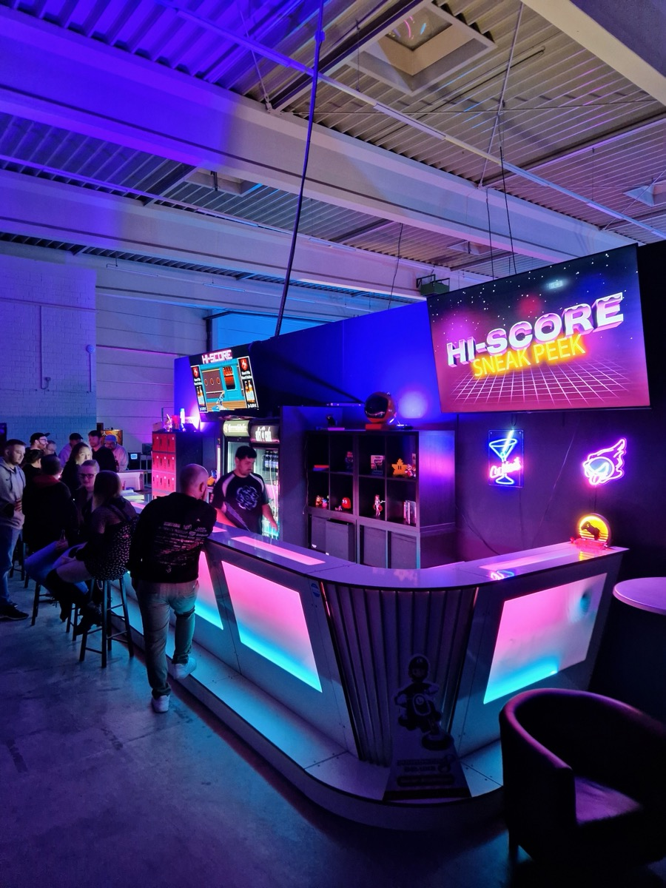
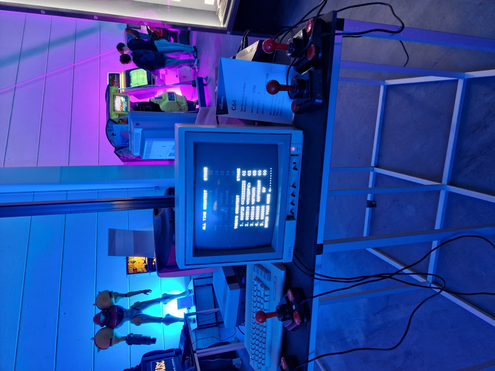
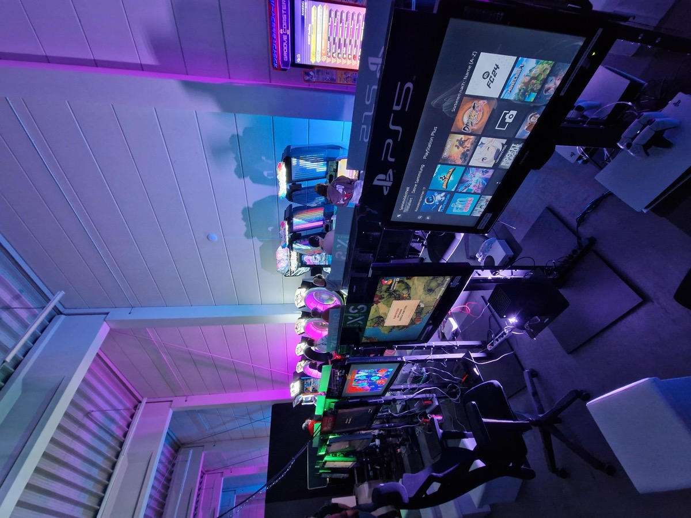

Was lange währt, wird endlich gut. So kann man den Umzug des [Hi-Score](https://hi-score.org/) in Hannover in eine neue Location zusammenfassen.
Das Erlebnismuseum für Videospiele startete zunächst im ehemaligen Galeria Kaufhof Gebäude mitten in Hannover und ist im Laufe des Jahres nach Südstadt gezogen. Beim Sneak Peak Event am vergangenen Wochenende konnten wir die Neuauflage des Museums ausgiebig anspielen.

## Ausstellung

Rund 300 Exponate aus den 70ern bis zur Gegenwart sind im neu gestalteten Hi-Score ausgestellt. Darunter befinden sich etliche Konsolen und Arcade Automaten, an denen Besucher nach Herzenslust spielen können. Alle Automaten sind auf "Free Play" eingestellt, d.h. anders als üblich, müsst ihr natürlich keine weiteren Münzen einwerfen um zu spielen. Das Museum ist nach Jahrzehnten aufgeteilt und führt euch von der Anfangszeit der Videospiele in den 70ern weiter durch die Zeit bis hin zur Gegenwart. So können sich Besucher vom Magnavox Odyssey (die erste Videospielkonsole), über das Super Nintendo, die Playstation 1 und Xbox, bis hin zu den modernsten Konsolen entlang hangeln. 

Uns wurde beim Event gesagt, dass die Ausstellung zu 95% fertig sei. Bei unserem Rundgang waren einige Bildschirme noch dunkel. Insbesondere bei Arcade Automaten bleiben notwendige Reparaturen nicht aus. Erst recht nicht, wenn es sich um größere interaktive Automaten handelt, bei denen viele bewegliche Teile involviert sind.

Als Sammler und Fan von Retro Konsolen, waren wir vor allem an den exotischen Exponaten interessiert. Super Nintendo und co. haben wir schließlich schon selbst zuhause stehen. Dennoch kommen wir beim Hi-Score voll auf unsere Kosten. Neben den populären Konsolen findet man auch seltenere Konsolen wie das PC-Engine. Besonders interessant sind aber die Arcade Automaten. Anders als in den USA und Japan, entwickelte sich in Deutschland nie eine große Arcade-Hallen Kultur. Schuld daran sind strickte [Jugendschutzgesetze](https://www.bgbl.de/xaver/bgbl/start.xav?start=//*%5B@attr_id=%27bgbl185s0425.pdf%27%5D#__bgbl__%2F%2F*%5B%40attr_id%3D%27bgbl185s0425.pdf%27%5D__1728455288081) von 1985 bis 2002, durch die keine Videospielautomaten an öffentlichen Plätzen aufgestellt werden durften.

Die Arcade Auswahl des Hi-Score ist durchaus beeindruckend und deckt die ganze Bandbreite gut ab. Es gibt Klassiker wie Space Invaders, Fighting Games wie Street Fighter 2, Light Gun Shooter, Rennspiele, eine sehr große Auswahl an Rhytmus Spielen, Tanz-Automaten sowie einige sehr ausgefallene Automaten. Unsere persönlichen Highlights sind der Light Gun Shooter "Point Blank" und das Rhytmus Box-Spiel "Fighting Mania: Fist of the North Star". Bei letzterem zieht ihr euch Boxhandschuhe an und müsst äußerst schnell als auch im passenden Rhytmus, verschiedene Ziele schlagen.





Es ist schön zu sehen, wie das Hi-Score nach dem Pilotprojekt in der Innenstadt, es geschafft hat sich zu einem coolen Ort für die Community zu entwickeln. Die Atmosphäre beim Sneak Peak war sehr einladend. Das Personal und andere Besucher waren alle freundlich und hilfsbereit und freuten sich gemeinsam zocken zu können. Besonders viel war im Rhytm-Game Bereich los. Hier reihten sich einige sehr fortgestrittene Spieler aneinander, die mit Baumwollhandschuhen und Kopfhörern, beeindruckendes Können demonstrierten. Szenen, die man sonst nur von Videos aus japanischen Arcades kennt.

## Wie geht es weiter?

Wann das Hi-Score offiziell eröffnen darf, steht leider noch nicht fest. Aktuell müssen noch einige Formalitäten mit den Behörden geklärt werden, bevor das Museum in den Regelbetrieb übergehen darf. Wer trotzdem schonmal reinschnuppern möchte, kann das ausnahmsweise am **Samstag den 12. Oktober** tun. Aufgrund der hohen Nachfrage und des Zuspruchs öffnet das Hi-Score dann zu einem zweiten Sneak Peak Event. Die Tickets für einen Besuch kosten 20€ und können auf [Hi-Score.org](https://hi-score.org) gebucht werden.

